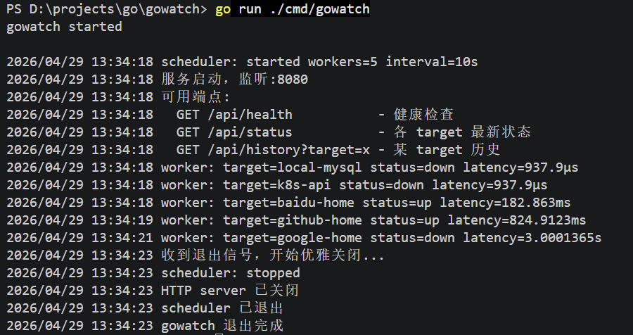
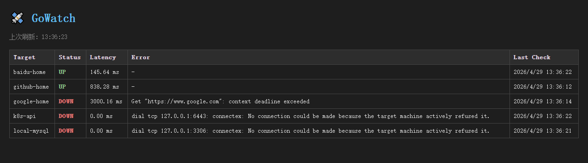

# GoWatch

> 一个用 Go 写的轻量探活监控服务 —— 配置、探测、持久化、HTTP API、Web 面板、Prometheus 指标,单二进制运行。




GoWatch 周期性地对一组 HTTP / TCP 目标做健康检查,把结果写入 SQLite 持久化,并通过 HTTP API + Web UI + Prometheus `/metrics` 端点暴露出来。整个服务是一个**常驻进程**,支持 graceful shutdown,可以放心 Ctrl+C 或 SIGTERM。

---

## ✨ 特性

- **多协议健康检查** — HTTP(S) 状态码 / TCP 端口连通性,通过 `Checker` 接口扩展
- **并发 Worker Pool 调度** — 固定 worker + Ticker 周期触发 + collector 解耦写库
- **SQLite 持久化** — 纯 Go 驱动 (`modernc.org/sqlite`),无 CGO,跨平台编译零负担
- **REST API + Web UI** — 实时状态、按 target 查历史,前端 5 秒自动刷新
- **Prometheus 集成** — `/metrics` 端点暴露 counter / histogram / gauge,可直接接 Grafana
- **Graceful Shutdown** — `signal.NotifyContext` + `server.Shutdown` + scheduler done channel 三步收尾,不丢数据
- **CLI 工具化** — 同一个二进制支持服务模式、查询历史、查看最新状态三种用法

---

## 🏗️ 架构

```
                 主 goroutine (scheduler.Run)
                          │
                          │ Ticker 每 N 秒触发 dispatch
                          ▼
                    jobs channel ──┬─→ worker 1 ─┐
                                   ├─→ worker 2 ─┤
                                   ├─→ worker 3 ─┼─→ results channel ─→ collector ─→ SQLite
                                   ├─→ worker 4 ─┤
                                   └─→ worker 5 ─┘

ctx.Done() ─→ close(jobs) ─→ workers 退出 ─→ close(results) ─→ collector 退出 ─→ store.Close
```

**三层 goroutine 职责分离:**
- **主 goroutine** — Ticker 派活、监听 ctx 信号、协调关闭顺序
- **Worker Pool** — 并发跑 `Checker.Check(ctx)`,IO 密集场景天然受益于并发
- **Collector** — 单独 goroutine 串行写库,把 IO 与 worker 解耦,数据库不会成为并发瓶颈

---

## 🚀 快速开始

### 安装

```bash
git clone https://github.com/jiayu113/gowatch.git
cd gowatch
go build -o gowatch ./cmd/gowatch
```

或直接运行:

```bash
go run ./cmd/gowatch
```

### 配置

在项目根目录创建 `config.yaml`:

```yaml
targets:
  - name: baidu-home
    type: http
    url: https://www.baidu.com
    timeout: 3s

  - name: local-mysql
    type: tcp
    url: 127.0.0.1:3306
    timeout: 2s

  - name: k8s-api
    type: tcp
    url: 127.0.0.1:6443
    timeout: 1s
    
  - name: github-home
    type: http
    url: https://www.github.com
    timeout: 3s

  - name: google-home
    type: http
    url: https://www.google.com
    timeout: 3s
```

URL 以 `http://` / `https://` 开头会自动用 HTTPChecker,否则视作 `host:port` 走 TCPChecker。

### 启动服务

```bash
./gowatch
```

默认行为:
- 加载 `./config.yaml`
- 数据库写入 `./gowatch.db`
- HTTP 服务监听 `:8080`
- Worker 数 5,探测周期 10 秒
- Ctrl+C / SIGTERM 优雅退出

启动后:

```
gowatch started

2026/04/29 11:50:32 scheduler: started workers=5 interval=10s
2026/04/29 11:50:32 服务启动,监听 :8080
2026/04/29 11:50:32 可用端点:
2026/04/29 11:50:32   GET /api/health           - 健康检查
2026/04/29 11:50:32   GET /api/status           - 各 target 最新状态
2026/04/29 11:50:32   GET /api/history?target=x - 某 target 历史
```

### 命令行选项

| 选项 | 默认值 | 说明 |
|------|--------|------|
| `--config` | `config.yaml` | 配置文件路径 |
| `--db` | `gowatch.db` | SQLite 数据库路径 |
| `--port` | `:8080` | HTTP 监听端口 |
| `--query` | `false` | 查询历史模式(查完即退) |
| `--target` | `""` | 配合 `--query`,只查指定 target |
| `--limit` | `20` | 配合 `--query`,返回条数上限 |
| `--latest` | `false` | 查询每个 target 的最新一条状态 |

```bash
# 查最近 50 条历史
./gowatch --query --limit 50

# 查 baidu-home 的最近 20 次记录
./gowatch --query --target baidu-home

# 查每个 target 当前最新状态(命令行版的 /api/status)
./gowatch --latest
```

---

## 📡 API

打开浏览器访问 `http://localhost:8080` 看 Web 面板,或者直接调 API:

### `GET /api/health`

```json
{
  "status": "ok",
  "uptime": "1h2m52.9687301s"
}
```

### `GET /api/status`

返回每个 target 的最新一条记录:

```json
[
  {
    "Target": "baidu-home",
    "Status": "up",
    "Latency": 144797200,
    "Error": "",
    "Timestamp": "2026-04-29T03:50:42Z"
  },
  {
    "Target": "github-home",
    "Status": "down",
    "Latency": 3000079500,
    "Error": "Get \"https://www.github.com\": context deadline exceeded",
    "Timestamp": "2026-04-29T03:50:45Z"
  }
]
```

### `GET /api/history?target=<name>`

返回指定 target 的历史记录(最多 20 条,按时间倒序)。

### `GET /metrics`

Prometheus 兼容的指标端点,暴露:

| 指标 | 类型 | 说明 |
|------|------|------|
| `gowatch_check_total{target,status}` | counter | 累计检查次数,按 target 和 up/down 分桶 |
| `gowatch_check_errors_total{target}` | counter | 累计错误次数 |
| `gowatch_check_latency_seconds{target}` | histogram | 检查耗时分布 |
| `gowatch_target_up{target}` | gauge | 当前是否 up(1=up, 0=down) |
| 标准 Go runtime 指标 | - | goroutine 数、heap、GC 等 |

---

## 🧪 稳定性验证(1 小时 Soak Test)

5 个真实 target,interval 10s,本机连续运行 **1 小时 2 分钟**,共完成 **1825 次健康检查**(5 × 365,均匀无遗漏)。

### 资源稳定性

| 指标 | 启动 3min57s | 运行 1h2m | 变化 | 结论 |
|------|-------------|-----------|------|------|
| `go_goroutines` | 23 | **23** | **0** | ✅ 无 goroutine 泄漏 |
| `heap_inuse_bytes` | 4.19 MB | 4.09 MB | -2% | ✅ heap 稳定甚至轻微下降 |
| `process_resident_memory` | 23.7 MB | ~25 MB | <5% | ✅ 常驻内存稳定 |
| `gowatch_check_total` (per target) | 23 | 365 | +342 | ✅ 调度公平,5 个 target 完全均匀 |

### 三种失败模式分类

5 个 target 覆盖了不同层的失败,验证 checker 路径:

| 失败类型 | 示例 | Latency | Error 信号 |
|---------|------|---------|-----------|
| **应用层超时** | github-home (GFW 阻断) | ~3000ms | `context deadline exceeded` |
| **传输层 RST** | k8s-api (端口未监听) | < 1ms | `connection refused` |
| **正常响应** | baidu-home | ~150ms | - |

这一观察启发了 v2 的改进方向:**给 `errors_total` 加 `error_type` label(timeout / refused / dns / non_2xx)**,让监控不仅能告诉你"挂了",还能告诉你"怎么挂的"。

---

## 🎯 设计决策

### 为什么 Checker 是接口而不是函数?

```go
type Checker interface {
    Check(ctx context.Context) Result
}
```

接口最小化(只一个方法),HTTP 和 TCP 是两个独立实现。新增 ICMP / gRPC / DNS 探测时无需改 scheduler,只要实现接口、注册到 factory 即可。

### 为什么 Check 返回 `Result` 而不是 `(Result, error)`?

业务上"探测失败"不是程序错误,**它就是 Result 的一种合法状态**。把 Error 字段塞进 Result 里,调用方拿到一个值就能知道全部信息,不用 `if err != nil` 判断两次。

### 为什么 worker pool 用固定数量而不是 per-target 一个 goroutine?

- 假设 1000 个 target,per-target 模式起 1000 个 goroutine 既浪费也不好控制
- 固定 5 个 worker 在 IO 密集场景已经够(每个 worker 90% 时间在 IO 等待)
- 真要扩,改一个数字就行,不用改架构

### 为什么 collector 单独 goroutine 写库?

避免 N 个 worker 同时往 SQLite 写造成锁竞争。worker 把结果丢 channel 就回去探测下一个,collector 串行消费 → SQLite 写入,IO 与计算解耦。

### Graceful Shutdown 的关闭顺序

```go
ctx.Done()                   // 1. 收到信号
  → server.Shutdown(ctx)     // 2. HTTP server 不再接新连接,在跑的请求继续
  → close(jobs)              // 3. scheduler 内部:workers 自然退出
  → wg.Wait()                // 4. 等所有 workers 收尾
  → close(results)           // 5. collector 看到 channel 关闭后退出
  → <-poolDone               // 6. main 等 scheduler 完全结束
  → defer store.Close()      // 7. 最后关数据库
```

**关键不变量**:数据库不会在还有数据要写的时候被关闭。

---

## 🛠️ 开发

### 目录结构

```
gowatch/
├── cmd/gowatch/main.go              # 入口:flag、模式分派、生命周期管理
├── internal/
│   ├── config/                      # YAML 配置加载
│   ├── checker/                     # Checker 接口 + HTTP/TCP 实现
│   ├── storage/                     # SQLite 封装 + 单元测试
│   ├── api/                         # HTTP Handler + Web UI
│   └── scheduler/                   # Worker Pool + Ticker + Collector
├── config.yaml                      # 配置示例
├── go.mod
└── README.md
```

### 跑测试

```bash
# 单独跑 storage 测试(用 :memory: SQLite,不写真实文件)
go test -v ./internal/storage/

# 全量
go test -v ./...

# 带覆盖率
go test -cover ./...
```

### 接 Prometheus + Grafana(可选)

`prometheus.yml` 加抓取配置:

```yaml
scrape_configs:
  - job_name: 'gowatch'
    static_configs:
      - targets: ['localhost:8080']
```

然后在 Grafana 里画 `gowatch_target_up`、`rate(gowatch_check_errors_total[5m])`、`histogram_quantile(0.99, rate(gowatch_check_latency_seconds_bucket[5m]))` 等。

---

## 📝 路线

### v1 (Done)
- [x] config / checker / storage / api / scheduler 五大核心包
- [x] CLI 多模式 + Web UI
- [x] Prometheus `/metrics` 集成
- [x] Graceful shutdown
- [x] 1 小时 soak test 验证稳定性

### v2 (进行中)
- [ ] `errors_total` 加 `error_type` label,区分 timeout / refused / dns / non_2xx
- [ ] config 热加载(fsnotify)
- [ ] 告警规则引擎(基于阈值触发 webhook / 邮件)
- [ ] 静态资源 embed.FS,单二进制部署

### v3
- [ ] 多实例部署 + etcd 协调,避免重复探测
- [ ] K8s 集成:从 Service / Endpoints 自动发现 target
- [ ] 接入 OpenTelemetry,支持分布式追踪

---

## 📄 License

[MIT](LICENSE)
