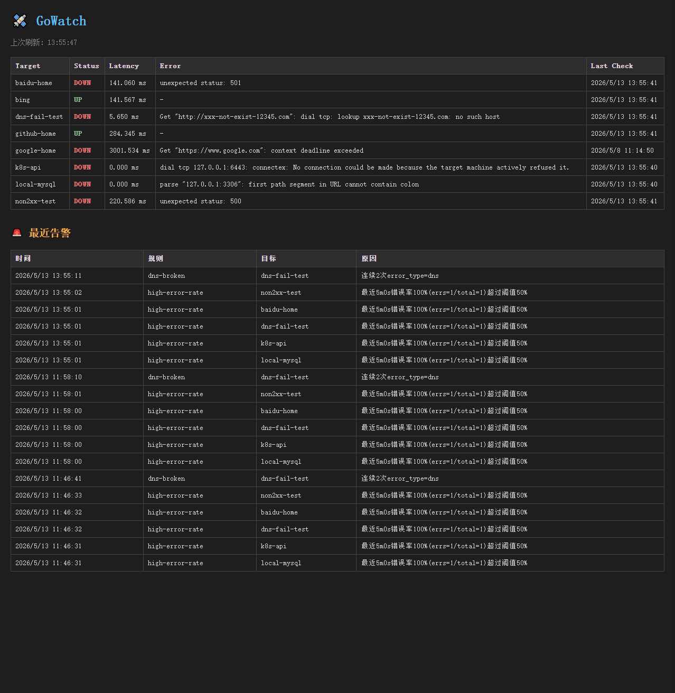

# GoWatch

> 用 Go 写的轻量探活监控服务 —— 配置驱动、并发探测、错误分类、SQLite 持久化、HTTP API、Web 面板、Prometheus 指标、告警规则引擎、**多实例 active-standby**。单二进制、无 CGO、跨平台。



GoWatch 周期性地对一组 HTTP / TCP 目标做健康检查,把结果按**错误类型**分桶并写入 SQLite,通过 HTTP API + Web UI + Prometheus `/metrics` 端点暴露,命中告警规则后走 webhook 通知并落库。**v2 引入多实例部署**:通过 etcd 协调实现 active-standby 选主,任意时刻只有一个实例在跑 scheduler,Leader 失效后 follower 自动接管;**单机模式 100% 向后兼容(不开 `--cluster` flag 时行为与之前完全一致)**。整个服务是常驻进程,支持优雅关闭,可以放心 Ctrl+C 或 SIGTERM。

---

## 特性

- **多协议健康检查** — HTTP(S) 状态码 / TCP 端口连通性,通过 `Checker` 接口扩展
- **并发 Worker Pool 调度** — 固定 worker + Ticker 周期触发 + collector 解耦写库
- **错误分类(`error_type`)** — 把网络层错误归类为 `timeout` / `refused` / `dns` / `non_2xx` / `other`,Prometheus 指标按错误类型分桶,**让告警规则能区分"网络抖动"和"服务挂了"**
- **告警规则引擎** — 三种语义的规则匹配 + cooldown 抑制(支持 etcd 跨重启持久化)+ webhook 通知 + 持久化,**异步发起、永不阻塞探测主链路**
- **多实例 active-standby(v2 新增)** — `internal/cluster` 包封装 etcd Election,**Leader 跑 scheduler,follower 阻塞在 Campaign,session 失效后自动重新参选**;scheduler 对 cluster 层完全透明,单机模式不开 `--cluster` 完全向后兼容
- **SQLite 持久化** — 纯 Go 驱动 (`modernc.org/sqlite`),无 CGO,跨平台编译零负担
- **REST API + Web UI** — 实时状态、按 target 查历史、最近告警列表,前端 5 秒自动刷新
- **Prometheus 集成** — `/metrics` 端点暴露 counter / histogram / gauge,可直接接 Grafana
- **Graceful Shutdown** — `signal.NotifyContext` + `server.Shutdown` + scheduler done channel 三步收尾,不丢数据;集群模式额外加 leader 优雅下台(取消 leaderCtx + 5s 超时兜底)
- **配置热加载(fsnotify)** — 监听 config.yaml 变化,200ms debounce 防抖,下一轮 dispatch 切换到新 checker
- **CLI 工具化** — 同一个二进制支持服务模式、查询历史、查看最新状态三种用法

---

## 架构

### 单机模式(默认)

```
                 主 goroutine (scheduler.Run)
                          │
                          │ Ticker 每 N 秒触发 dispatch
                          ▼
                    jobs channel ──┬─→ worker 1 ─┐
                                   ├─→ worker 2 ─┤
                                   ├─→ worker 3 ─┼─→ results channel ─→ collector ─┬─→ SQLite
                                   ├─→ worker 4 ─┤                                 ├─→ Prometheus 指标更新
                                   └─→ worker 5 ─┘                                 └─→ alert.Evaluator.OnResult
                                                                                       │
                                                                                       ▼
                                                                            Window (per-target ring) → Rule.Match
                                                                                       │
                                                                                       ▼ 命中且未在 cooldown
                                                                            go fire(rule, event)
                                                                                       │
                                                                                       ├─→ Webhook(POST,5xx 重试 1 次)
                                                                                       └─→ emit channel → SaveAlert

ctx.Done() ─→ close(jobs) ─→ workers 退出 ─→ close(results) ─→ collector 退出 ─→ store.Close
```

**三层 goroutine 职责分离:**
- **主 goroutine** — Ticker 派活、监听 ctx 信号、协调关闭顺序
- **Worker Pool** — 并发跑 `Checker.Check(ctx)`,IO 密集场景天然受益于并发,每个 worker 用 per-target 独立 ctx 避免互相拖累
- **Collector** — 单独 goroutine 串行写库 + 同步更新 Prometheus 指标 + 调用 `evaluator.OnResult`,把 IO 与指标写入和 worker 解耦

### 集群模式(`--cluster`)

scheduler 不变,外面套一层 cluster.Leader 来负责"谁跑"。Leader 用回调式 API,scheduler 不知道自己是不是 leader,只是被传入了一个 ctx:

```
                ┌─────────────────────────────┐
                │           etcd              │
                │  /gowatch/leader (election) │
                └──────────────┬──────────────┘
                               │
              ┌────────────────┴────────────────┐
              │                                 │
         Instance A                        Instance B
   leader.Run(ctx, pool.Run)         leader.Run(ctx, pool.Run)
              │                                 │
              ▼                                 ▼
         Election wins                   Blocked on Campaign
              │                                 │
              ▼                                 │
     pool.Run(leaderCtx)                        │ wait...
              │                                 │
              │ session.Done()                  │
              │ or ctx.Done()                   │
              ▼                                 ▼
         DEMOTE (cancel leaderCtx,     Election wins (≤15s)
         wait scheduler done ≤5s)              │
              │                                 ▼
              └─→ backoff → CAMPAIGN     pool.Run(leaderCtx)
                  (1s→2s→...→30s)
```

**关键设计:**

- **回调式 API:`leader.Run(ctx, onLeader func(ctx))`** — cluster 对 scheduler 完全透明,scheduler 看到的只是"一个 ctx,跑就行,取消就退";没有 `IsLeader()` 这种状态查询,**避免了 TOCTOU 类竞态**(query → act 之间状态可能已变)
- **scheduler 100% 复用** — 同一份 `pool.Run(ctx)` 代码,单机模式直接调,集群模式被 `leader.Run` 包裹后调;集群上位 = leaderCtx 启动,session 失效 = leaderCtx 取消,scheduler 自然退出
- **fail-fast on startup, backoff at runtime** — 启动期 etcd dial 失败直接报错(配置错应该让人看见);运行期 etcd 抖动用指数退避(1s → 2s → ... ≤ 30s),不让重连风暴打挂 etcd
- **优雅下台 5s 上限** — session 失效或 ctx cancel 时,先取消 leaderCtx 让 scheduler 自己收尾;`select` 等 done channel,5s 后超时强退,**不让一个挂掉的 scheduler 阻塞自身退出**
- **session TTL 默认 15s** — 心跳 / 5s,容忍 1-2 次丢包;权衡了"切换太快导致 false failover"和"切换太慢导致探测停摆"
- **依赖外部监控** — 集群无 leader / split-brain 这种事 GoWatch 自己监控不到(自己就是被监控的对象),必须接 Alertmanager(详见下文"多实例部署")

### 告警引擎链路

```
collector ──→ evaluator.OnResult(r)
                  │
                  ├─→ window.Push(r)              // per-target ring buffer,cap=50
                  │
                  └─→ for rule in rules:
                          if rule.Target != "*" && rule.Target != r.Target: continue
                          snap = window.Snapshot(r.Target)         // 独立副本,避免锁外修改
                          hit, reason = rule.Match(snap)
                          if hit && suppressor.Allow(rule,target,cooldown):
                              go fire(rule, event)                 // 异步,不阻塞 collector
                                  ├─→ webhook POST(5s timeout, 5xx 重试 1 次, 4xx 不重试)
                                  └─→ emit ch → store.SaveAlert
```

**关键设计:**

- **`OnResult` 永不阻塞主链路** — Window.Push 与 suppressor.Allow 是 ms 级内存操作;真正可能慢的 webhook 全部丢进 `go fire(...)`,网络抖动绝对不会拖死 collector
- **复用 v1 的 `error_type` 维度** — `consecutive_error_type` 规则可以做到"连续 2 次 dns 失败才告警",这是单纯 status 维度做不到的判断
- **Suppressor 是 (rule, target) 二元 key** — 同一规则在不同 target 上的 cooldown 互相独立,一个 target 在抑制窗口内不会让别的 target 也被静默
- **Suppressor 跨重启持久化(v2 新增)** — `AllowAndPersist` 异步写 etcd,`LoadFromEtcd` 启动时回灌内存状态;**重启或 leader 切换后,cooldown 不再清零**;`cli == nil` 时自动降级为纯内存,单机模式无侵入
- **Window cap=50 ring buffer** — 满了从尾部裁剪,保证内存有上界;`Snapshot` 返回独立副本,有专门的 unit test 守住这个契约
- **Webhook 重试策略** — 5xx 视为服务端临时故障,500ms 后重试 1 次;4xx 是客户端语义错误(URL 写错、payload 不合规),重试也没用,直接返回;网络错误按 5xx 处理
- **emit channel buffer=100 + default drop** — `SaveAlert` 慢于产出时丢日志并 drop,不阻塞 fire goroutine

---

## 快速开始

### 安装

```bash
git clone https://github.com/jiayu113/gowatch.git
cd gowatch
go build -o gowatch ./cmd/gowatch
```

或直接运行:

```bash
go run ./cmd/gowatch
```

### 配置

在项目根目录创建 `config.yaml`(探测目标):

```yaml
targets:
  - name: baidu-home
    type: http
    url: https://www.baidu.com
    timeout: 3s

  - name: local-mysql
    type: tcp
    url: 127.0.0.1:3306
    timeout: 2s

  - name: dns-fail-test
    type: http
    url: http://xxx-not-exist-12345.com
    timeout: 3s
```

通过 `type` 字段显式指定探测协议(`http` 或 `tcp`),scheduler 会构造对应的 Checker 实例。修改后保存,无需重启;watcher 检测到变化后会触发 reload,下一轮 dispatch 自动用新配置。

### 告警规则(可选)

在根目录创建 `alerts.yaml`,即可启用告警引擎:

```yaml
rules:
  - name: github-flapping
    target: github-home
    type: consecutive_status
    status: down
    threshold: 3
    cooldown: 5m
    webhook: http://localhost:9999/test-webhook

  - name: dns-broken
    target: "*"
    type: consecutive_error_type
    error_type: dns
    threshold: 2
    cooldown: 10m
    webhook: http://localhost:9999/test-webhook

  - name: high-error-rate
    target: "*"
    type: error_rate_window
    threshold: 50
    window: 5m
    cooldown: 10m
    webhook: http://localhost:9999/test-webhook
```

**`alerts.yaml` 文件不存在或加载失败,告警引擎自动关闭,不影响主服务启动。**

### 启动服务(单机模式)

```bash
./gowatch
```

默认行为:
- 加载 `./config.yaml`(必需) + `./alerts.yaml`(可选)
- 数据库写入 `./gowatch.db`(同一个库,checks 表 + alerts 表)
- HTTP 服务监听 `:8080`
- Worker 数 5,探测周期 10 秒
- Ctrl+C / SIGTERM 优雅退出

### 命令行选项

| 选项 | 默认值 | 说明 |
|------|--------|------|
| `--config` | `config.yaml` | 配置文件路径 |
| `--db` | `gowatch.db` | SQLite 数据库路径 |
| `--port` | `:8080` | HTTP 监听端口 |
| `--query` | `false` | 查询历史模式(查完即退) |
| `--target` | `""` | 配合 `--query`,只查指定 target |
| `--limit` | `20` | 配合 `--query`,返回条数上限 |
| `--latest` | `false` | 查询每个 target 的最新一条状态 |
| `--cluster` | `false` | 启用多实例集群模式(需同时指定 `--etcd`) |
| `--etcd` | `""` | etcd endpoints,逗号分隔,如 `etcd1:2379,etcd2:2379` |
| `--node-id` | hostname | 本实例节点 ID,用作 election value 和日志标识 |

```bash
# 查最近 50 条历史
./gowatch --query --limit 50

# 查 baidu-home 的最近 20 次记录
./gowatch --query --target baidu-home

# 查每个 target 当前最新状态(命令行版的 /api/status)
./gowatch --latest
```

---

## 多实例部署

GoWatch 通过 etcd 协调实现 active-standby,**任意时刻只有一个实例在跑 scheduler,避免重复探测和重复告警**。

### 启动

```bash
# 实例 A
./gowatch --cluster --etcd=etcd1:2379,etcd2:2379 --node-id=node-a \
    --port=:8080 --db=/var/lib/gowatch/a.db --config=/etc/gowatch/config.yaml

# 实例 B(同一份 config.yaml,不同 db / port / node-id)
./gowatch --cluster --etcd=etcd1:2379,etcd2:2379 --node-id=node-b \
    --port=:8081 --db=/var/lib/gowatch/b.db --config=/etc/gowatch/config.yaml
```

不指定 `--node-id` 时默认用 `hostname`。容器化部署建议显式传入 Pod 名或 Deployment 名,避免重启导致 hostname 变化让 leader 身份漂移。

### 行为

- **任意时刻只有一个 instance 在跑 scheduler** — follower 阻塞在 `Election.Campaign`,HTTP server 也是起着的(只是 scheduler 没在跑)
- **Leader 失效后 follower 在 ~15s 内自动接管** — TTL 15s + lease 心跳 / 5s,理论窗口 5-15s
- **session 抖动自动恢复** — leader session 失效后会自动 demote 并重新参选,不需要人工介入
- **单机模式行为不变** — 不开 `--cluster` flag 时,代码路径与之前完全一致

### 必备外部监控

GoWatch **自己是被监控对象,无法监控自己的集群健康**,生产部署必须接 Alertmanager:

```yaml
# alertmanager rules
- alert: GoWatchNoLeader
  expr: absent(rate(gowatch_check_total[1m]) > 0)
  for: 2m
  annotations:
    summary: "GoWatch 集群无 leader,探测已停止"

- alert: GoWatchLeaderFlapping
  expr: changes(process_start_time_seconds{job="gowatch"}[10m]) > 3
  for: 5m
  annotations:
    summary: "GoWatch leader 可能频繁切换(10 分钟内重启 > 3 次)"
```

> `gowatch_is_leader` gauge metric 在下个版本(v2.x)加入,届时可以用更直接的 `absent(gowatch_is_leader == 1)` 表达"无 leader",`sum(gowatch_is_leader) > 1` 表达 split-brain。

### 已知 trade-off

- **切换期间可能重复告警一次** — 老 leader 退位 + 新 leader 上位的窗口内,如果探测命中告警规则,两边都有可能发出。Suppressor 跨重启已通过 etcd 共享,但**跨 leader 实例的 cooldown 还没完全对齐**(等 Evaluator 主流程接通 etcd 后解决,见 v2.x backlog)
- **切换后新 leader 的 SQLite 是空的** — `/api/history` 看不到上一任的数据,因为 SQLite 是 per-instance 的;接入共享存储(MySQL / TiDB)v3实现
- **etcd 全挂时无 leader** — GoWatch 的探测也会停下来,这就是为什么 `GoWatchNoLeader` 这条 Alertmanager 规则**不能省**
- **API 层没有 follower 模式** — 当前 follower 的 HTTP server 也在跑、`/api/status` 也能返回数据,但数据是这个实例自己的 SQLite,可能很陈旧;v2.x 计划加 `/api/cluster/status` + follower 返回 503 + 自定义 header,让上游负载均衡能识别

---

## API

打开浏览器访问 `http://localhost:8080` 看 Web 面板(包含目标状态表 + 最近告警表,5 秒自动刷新),或者直接调 API:

### `GET /api/health`

```json
{ "status": "ok", "uptime": "1h2m52.9687301s" }
```

### `GET /api/status`

返回每个 target 的最新一条记录:

```json
[
  {
    "target": "baidu-home",
    "status": "up",
    "latency_ms": 144.797,
    "error": "",
    "timestamp": "2026-05-13T03:50:42Z"
  }
]
```

### `GET /api/history?target=<name>&limit=<n>`

返回指定 target 的历史记录(`limit` 默认 20、上限 1000,按时间倒序)。

### `GET /api/alerts?limit=<n>`

返回最近触发的告警事件(默认 50、上限 1000,按 `fired_at` 倒序):

```json
[
  {
    "rule_name": "dns-broken",
    "target": "dns-fail-test",
    "fired_at": "2026-05-13T13:55:11Z",
    "reason": "连续2次error_type=dns"
  }
]
```

### `GET /metrics`

Prometheus 兼容的指标端点(详见下一节)。

---

## Prometheus 指标

| 指标 | 类型 | Labels | 说明 |
|------|------|--------|------|
| `gowatch_check_total` | counter | `target`, `status` | 累计检查次数,按 up/down 分桶 |
| `gowatch_check_errors_total` | counter | `target`, **`error_type`** | 累计错误次数,**按错误类型分桶** |
| `gowatch_check_latency_seconds` | histogram | `target` | 检查耗时分布 |
| `gowatch_target_up` | gauge | `target` | 当前是否 up(1=up, 0=down) |
| 标准 Go runtime 指标 | - | - | goroutine 数、heap、GC 等 |

> 集群模式相关 metric(`gowatch_is_leader` 等)在 v2.x 加入,届时可基于它配 Alertmanager 集群健康告警。

---

## 告警规则类型详解

### 1. `consecutive_status` — 连续 N 次 status 命中

```yaml
type: consecutive_status
status: down        # 或 up
threshold: 3
```

**语义:** 最近 N 次结果**全部**是指定 status 才触发。
**用法:** 最朴素的"3 次都挂了再叫"规则,避免单次网络抖动误报。
**注意:** 中间夹一次正常就清零,不是滑动窗口。

### 2. `consecutive_error_type` — 连续 N 次相同错误类型

```yaml
type: consecutive_error_type
error_type: timeout   # timeout / refused / dns / non_2xx / other
threshold: 3
```

**语义:** 最近 N 次错误**类型完全一致**才触发。
**用法:** 区分"网络抖动型抖动"和"特定故障模式"。比如:
- 连续 5 次 `timeout` → 大概率链路慢/丢包
- 连续 3 次 `dns` → DNS 服务真挂了
- 连续 3 次 `refused` → 后端服务进程没了

### 3. `error_rate_window` — 时间窗口内错误率

```yaml
type: error_rate_window
threshold: 50    # 百分比 0-100
window: 5m
```

**语义:** 在 `window` 时间窗口内,错误次数 / 总检测次数 ≥ `threshold`% 触发。
**用法:** 适合做"部分降级"告警 —— 不是连续挂,但成功率明显跌了。

---

## 开发

### 目录结构

```
gowatch/
├── cmd/gowatch/main.go          # 入口:flag、模式分派、生命周期管理、装配 evaluator + cluster
├── internal/
│   ├── config/                  # YAML 配置加载 + fsnotify 热加载
│   ├── checker/                 # Checker 接口 + HTTP/TCP 实现 + 错误分类
│   ├── storage/                 # SQLite 封装(checks + alerts 两张表)
│   ├── api/                     # HTTP Handler + Web UI(embed.FS)
│   ├── scheduler/               # Worker Pool + Ticker + Collector
│   ├── metrics/                 # Prometheus 指标定义
│   ├── alert/                   # 告警引擎:rule / matchers / window /
│   │                            #          suppressor(含 etcd 持久化)/
│   │                            #          notifier / evaluator
│   └── cluster/                 # etcd 选主:session / leader / backoff
├── config.yaml                  # 探测目标配置示例
├── alerts.yaml                  # 告警规则配置示例
├── go.mod
└── README.md
```

### 跑测试

```bash
# 单独跑某个包
go test -v ./internal/checker/   # checker 接口 + 错误分类
go test -v ./internal/storage/   # SQLite(:memory: 模式)
go test -v ./internal/alert/     # 规则匹配 + Window + Suppressor(含 etcd 持久化)+ Notifier + 集成 + 故障注入
go test -v ./internal/cluster/   # embedded etcd + Campaign / Failover / SessionExpire / CtxCancel

# 全量
go test -v ./...

# 带覆盖率
go test -cover ./...
```

**`internal/cluster` 测试覆盖的重点(全部基于 `go.etcd.io/etcd/server/v3/embed` 内嵌 etcd,无需外部容器):**

- `TestEmbeddedEtcd` — sanity 测试,验证 embedded etcd 起得来并能 Put/Get,后续测试的地基
- `TestLeader_CampaignSucceeds` — happy path,实例能成功 Campaign + 接收 ctx cancel + 干净退出
- `TestLeader_TwoInstancesFailover` — A 上位后 B 必须阻塞;cancel A 的 ctx 后 B 在 10s 内接管
- `TestLeader_SessionExpires` — 真实故障场景:直接 `Revoke` 掉 leader 的 lease 模拟 etcd 视角的 session 死亡,验证 follower 接管
- `TestLeader_CtxCancelTriggersExit` — 优雅停机:ctx 被外部取消后,`Run` 必须在 7s 内退出

**`internal/alert` 测试覆盖的重点:**

- `matcher_test.go` — 三种规则各自的命中 / 不命中边界,包括 `Threshold=0` / 空 recent / 旧数据被窗口过滤这些容易漏掉的分支
- `window_test.go` — 关键契约:`Snapshot` 必须返回独立副本(调用方修改不影响内部),专门有一个 case 守这一行
- `suppressor_test.go` — cooldown 内拦截、不同 target 独立、`Cooldown=0` 永远放行;**`TestSuppressor_PersistAndLoad` 用 embedded etcd 模拟"持久化 → 进程重启 → 加载状态 → cooldown 仍生效"**
- `notifier_test.go` — 5xx 重试 1 次、4xx 不重试、success 路径数据透传
- `integration_test.go` — 用 `httptest.Server` 模拟 webhook,跑完整 OnResult → fire → webhook 链路 + cooldown 抑制
- `failure_test.go` — webhook 持续 5xx / 持续 timeout 时,**`OnResult` 主调用绝不被阻塞**(异步契约的回归测试)

### 接 Prometheus + Grafana(可选)

`prometheus.yml` 加抓取配置:

```yaml
scrape_configs:
  - job_name: 'gowatch'
    static_configs:
      - targets: ['localhost:8080']
```

然后在 Grafana 里画:

- `gowatch_target_up` — 当前每个 target 是否在线
- `sum by (error_type) (rate(gowatch_check_errors_total[5m]))` — 错误类型分布
- `histogram_quantile(0.99, rate(gowatch_check_latency_seconds_bucket[5m]))` — P99 延迟

---

## 路线

### v1 — Done

- [x] config / checker / storage / api / scheduler 五大核心包
- [x] CLI 多模式 + Web UI(embed.FS 单二进制)
- [x] 错误分类 `error_type`(timeout / refused / dns / non_2xx / other)+ Prometheus label 维度
- [x] Graceful shutdown + 关闭顺序保证
- [x] 1 小时 soak test:无 goroutine 泄漏、内存稳定、调度公平

### v2 — Done

- [x] **config 热加载(fsnotify)** — debounce 防抖 + 优雅降级 + reload 不停机切换
- [x] **告警规则引擎** — 三种规则语义 + Window + Suppressor + Webhook(含重试) + SQLite 持久化 + Web UI 展示
- [x] **告警系统的异步契约** — `OnResult` 永不阻塞 collector,webhook 故障(5xx/timeout)有专门的回归测试守护
- [x] **多实例 active-standby + etcd 选主** — `internal/cluster` 包,回调式 API,scheduler 对 cluster 透明;单机模式 100% 向后兼容;embedded etcd 4 场景单元测试(Campaign / Failover / SessionExpire / CtxCancel);fail-fast 启动 + 运行期指数退避 + 优雅下台 5s 兜底
- [x] **Suppressor 跨重启持久化** — etcd 后端(`AllowAndPersist` / `LoadFromEtcd`),异步写入不阻塞主链路;`cli == nil` 时自动降级为纯内存(单机模式无侵入);`PersistAndLoad` 单元测试覆盖

### v2.x — Backlog(已知 + 计划修复)

- [ ] **Evaluator 主流程接通 etcd Suppressor 持久化** — Suppressor 层 API 已完成,等待 `NewEvaluator` 接受 etcd client 参数后默认启用,跨实例 cooldown 才能真正对齐
- [ ] **API 层 follower 模式 + `gowatch_is_leader` metric + `/api/cluster/status`** — 让"集群感知"对外可见,follower 返回 503 + 自定义 header 标识身份,上游 LB 才能正确路由
- [ ] **dockertest e2e** — 起真实 etcd 容器跑端到端 leader 切换,补 embedded etcd 测不到的网络层场景(网络分区 / 慢链接)
- [ ] **`alerts.yaml` 热加载** — 复用 config watcher 的 debounce 思路,告警规则也支持运行时修改
- [ ] **`fsnotify` watcher 改为监听父目录** — 当前监听文件本身,在 vim / VSCode 等 atomic save 编辑器下首次保存后 watcher 失效;改为监听父目录 + filter base name 可解决
- [ ] **config 加载时 URL schema 校验** — type=http 校验 http/https 前缀,type=tcp 校验 host:port;否则配错时 latency=0s 看起来像服务挂,实际是配置错
- [ ] **`ClassifyNetErr` 真实包装链集成测试** — 用 `httptest` 触发真实 dial 失败,覆盖 mock 漏掉的路径
- [ ] **告警去重 / 抑制升级** — 当前是 (rule, target) 维度 cooldown;复杂场景可能要"先收敛再发"(N 分钟批量一条)
- [ ] **告警通知通道扩展** — 当前只支持 webhook;`Notifier` 接口已经抽出来,加 Email / 钉钉 / 飞书只是新加一个实现

### v3 — 长期

- [ ] K8s 集成:从 Service / Endpoints 自动发现 target(完整 Operator,用 controller-runtime + envtest 复用本周期的 embedded etcd 测试模式)
- [ ] 共享存储后端:接 MySQL / TiDB,切换 leader 后 `/api/history` 仍能看到完整历史
- [ ] 接入 OpenTelemetry,支持分布式追踪
- [ ] eBPF 探针,从内核层观测 TCP 状态

---

## 📄 License

[MIT](LICENSE)
